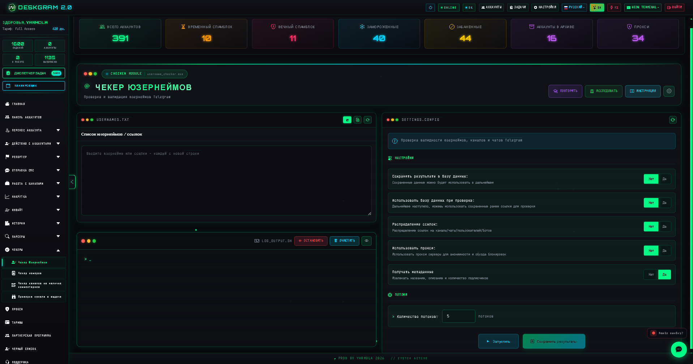
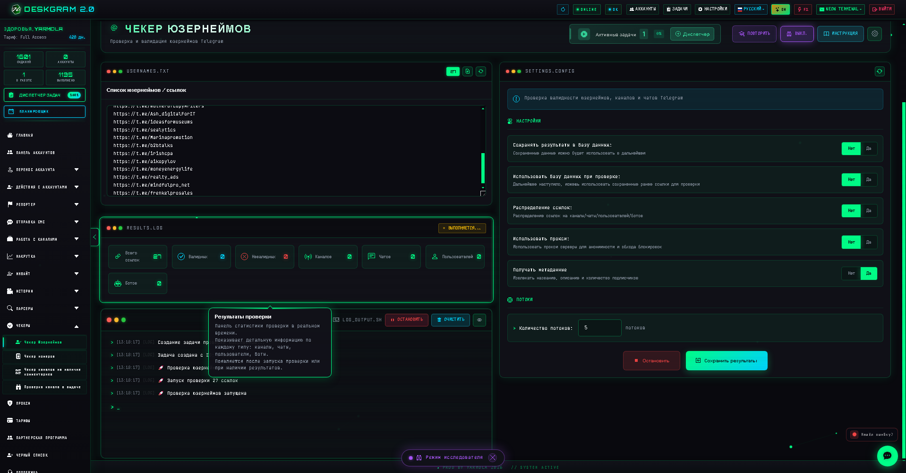
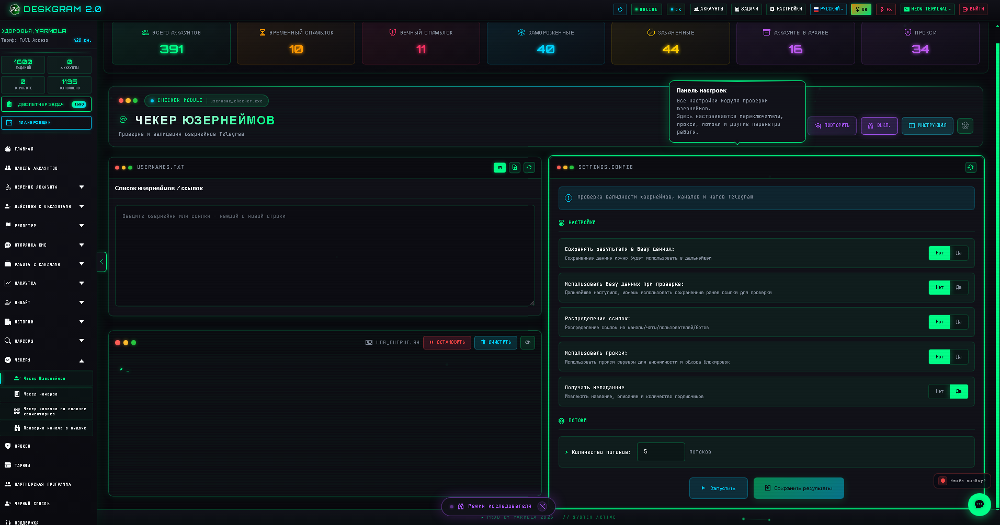
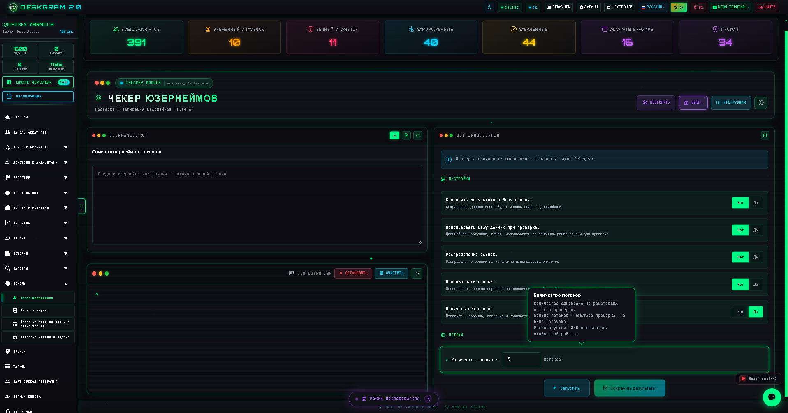

# Чекер юзернеймов Telegram через Deskgram 2

Чекер юзернеймов в Deskgram 2 помогает быстро проверить Telegram-юзернеймы и ссылки на валидность, тип объекта и дополнительные метаданные. Модуль полезен, когда база ссылок смешанная, неочищенная или собрана из разных источников и перед следующим шагом ее нужно привести в порядок.

[Главный хаб Deskgram 2](https://github.com/Deskgram-2/deskgram-2-telegram-automation) · [Сайт](https://deskgram2.com/) · [Telegram-бот](https://t.me/DG2welcomebot) · [Web preview](https://deskgram2.com/web-preview?path=%2Fapp-demo%2F&lang=ru)

## Интерактивный Web Preview

Попробовать модуль в браузере: [Открыть веб-превью](https://deskgram2.com/web-preview?path=%2Fapp-demo%2Ffunctions%2Fusername_checker&lang=ru)

Это удобно, если хотите заранее посмотреть таблицу результатов, статистику по типам объектов и рабочие настройки проверки.

## Скриншоты

## Кратко о модуле

| Параметр | Что внутри |
|---|---|
| Основная задача | Проверка Telegram-юзернеймов и ссылок на валидность |
| Важные блоки | Список ссылок, статистика по типам, прокси, потоки, метаданные |
| Полезен для | Очистки баз, сегментации discovery-результатов, подготовки outreach |
| Связанные модули | Чекер телефонов, Поиск каналов, Сбор аудитории |

## Что умеет модуль

- проверять, валидна ли Telegram-ссылка или юзернейм;
- разделять каналы, чаты, пользователей и ботов;
- получать дополнительные метаданные;
- работать через прокси и потоки;
- сохранять и повторно использовать результаты.

## Быстрый старт

1. Загрузите список ссылок или юзернеймов.
2. Настройте сохранение результатов, распределение и прокси.
3. Задайте количество потоков.
4. Запустите проверку и дождитесь статистики.
5. Используйте очищенный список в следующем сценарии.

## Где этот модуль особенно полезен

- [Чекер телефонов](https://github.com/Deskgram-2/telegram-phone-checker-deskgram), если вы параллельно чистите базу по номерам и ссылкам;
- [Поиск каналов и групп](https://github.com/Deskgram-2/telegram-channel-search-deskgram), если после discovery нужно быстро валидировать найденные ссылки;
- [Сбор аудитории](https://github.com/Deskgram-2/telegram-audience-parser-deskgram), если перед парсингом важно убрать шум и битые объекты;
- [Диспетчер задач](https://github.com/Deskgram-2/telegram-task-manager-deskgram), если проверка — часть большого пайплайна.

## Когда особенно полезен

- когда база ссылок собрана из разных источников и в ней много мусора;
- когда нужно быстро отделить пользователей, каналы, чаты и ботов;
- когда важна предварительная очистка перед outreach или parsing;
- когда нужно масштабно проверить базу, а не кликать ссылки вручную.

## Что выбрать: чекер юзернеймов или чекер телефонов

| Если задача такая | Лучше использовать |
|---|---|
| Есть база ссылок, юзернеймов и публичных объектов | [Чекер юзернеймов](https://github.com/Deskgram-2/telegram-username-checker-deskgram) |
| Есть база телефонных номеров | [Чекер телефонов](https://github.com/Deskgram-2/telegram-phone-checker-deskgram) |
| Нужен mixed-cleanup по двум типам баз | Оба модуля подряд |
| Нужен только быстрый прогон по публичным ссылкам | Чекер юзернеймов |

## Смежные репозитории

- [Главный хаб Deskgram 2](https://github.com/Deskgram-2/deskgram-2-telegram-automation)
- [Чекер телефонов](https://github.com/Deskgram-2/telegram-phone-checker-deskgram)
- [Поиск каналов и групп](https://github.com/Deskgram-2/telegram-channel-search-deskgram)
- [Сбор аудитории](https://github.com/Deskgram-2/telegram-audience-parser-deskgram)
- [Диспетчер задач](https://github.com/Deskgram-2/telegram-task-manager-deskgram)

## FAQ

### Можно ли сначала посмотреть интерфейс до запуска?

Да. Веб-превью позволяет заранее открыть результаты, настройки и потоковый блок.

### Этот модуль подходит только для юзернеймов?

Нет. Он полезен и для обычных Telegram-ссылок, которые нужно проверить и классифицировать.
